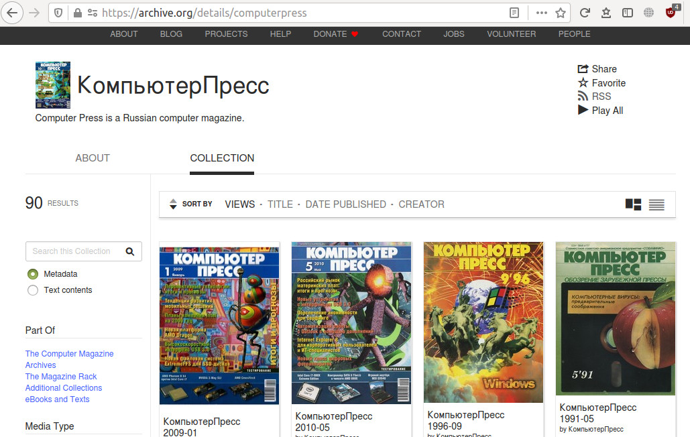
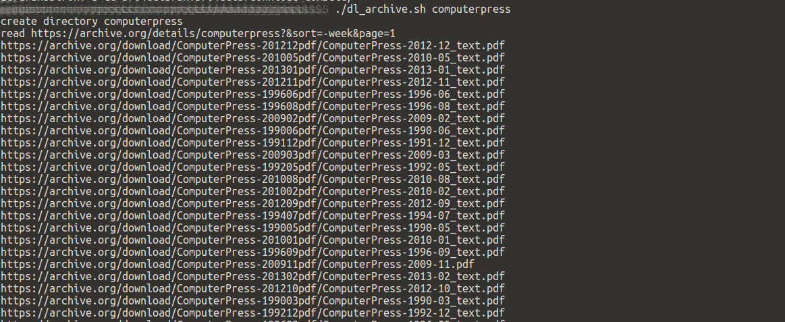
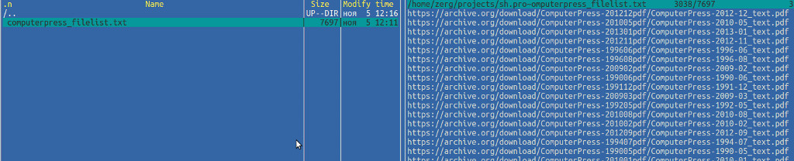

Скрипт генерирует список файлов для коллекций журналов на сайте archive.org  
Название коллекции задается первым параметром. Если коллекция с таким именем есть, то создаётся каталог с таким же именем и туда записывается файл со списком журналов. Поиск идет по файлам с расширением pdf и djvu. Если задать еще один параметр в командной строке (например -d, хотя на самом деле любой) то после создания списка запускается wget для скачивания файлов. 

./dl_archive.sh computerpress  
Создает каталог computerpress и файл computerpress_filelist.txt со списком журналов

./dl_archive.sh computerpress -d  
Скачивает коллекцию журналов

